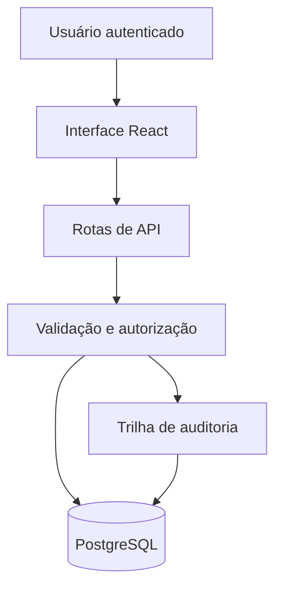
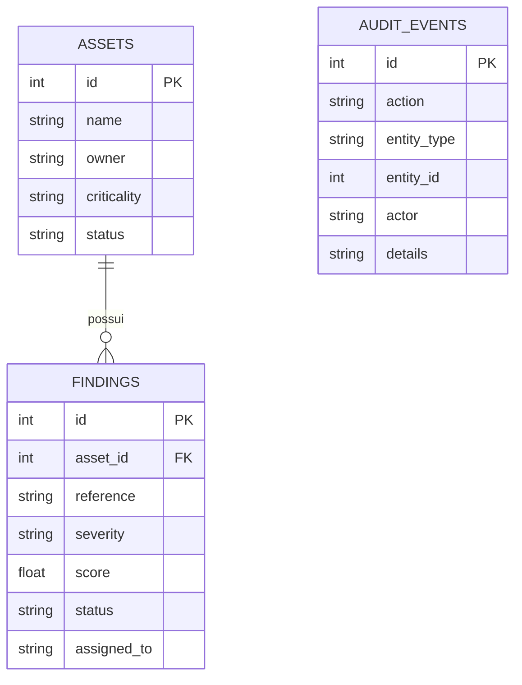

# Arquitetura do Prioris

## Visão geral

O Prioris usa uma arquitetura full-stack executada em Vercel Functions. A interface React consome rotas HTTP do próprio produto, que validam identidade e entrada antes de acessar o PostgreSQL.

## Camadas

| Camada | Responsabilidade | Arquivos principais |
| --- | --- | --- |
| Interface | Navegação, filtros, formulários, métricas e feedback | `app/page.tsx`, `app/globals.css` |
| API | Casos de uso e respostas HTTP | `app/api/**/route.ts` |
| Domínio | Validação, CSV, identidade e auditoria | `lib/*.ts` |
| Dados | Modelo, inicialização e migrations | `db/*.ts`, `drizzle/` |
| Runtime | Build e configuração de hospedagem | `next.config.ts`, `vercel.json` |

## Modelo de dados

Os eventos de auditoria mantêm uma referência lógica para diferentes tipos de entidade. Essa decisão evita várias tabelas de histórico em um projeto pequeno, com o custo de não possuir uma chave estrangeira única para `entity_id`.

## Fluxo de uma alteração

1. A interface envia os dados para uma rota da API.
2. O servidor identifica o usuário e recusa requisições sem identidade válida.
3. As funções de domínio normalizam e validam a entrada.
4. A API grava a mudança no PostgreSQL.
5. Um evento de auditoria registra ator, ação, entidade e descrição.
6. A interface atualiza os dados e os indicadores.

## Decisões técnicas

- **PostgreSQL:** banco relacional persistente, com constraints e suporte a transações.
- **Drizzle:** schema tipado e migrations versionadas.
- **Validação no servidor:** a interface melhora a experiência, mas a API continua sendo a fronteira de segurança.
- **Auditoria append-only pela aplicação:** os fluxos normais apenas inserem eventos; não existe endpoint para editá-los.
- **CSS próprio:** reduz dependências e demonstra domínio de layout responsivo.
- **CSV:** formato interoperável que pode ser aberto em planilhas sem criar uma dependência pesada.

## Limitações conhecidas

- os controles de governança são uma baseline demonstrativa, não uma certificação;
- não há integração com scanners reais ou sistemas de tickets;
- o workflow ainda não aplica uma máquina de estados rígida entre todas as transições;
- a autorização atual protege a identidade, mas não possui papéis separados de analista e administrador;
- os testes cobrem regras centrais e renderização, mas não substituem testes end-to-end completos.

Essas limitações são escolhas conscientes de escopo para um projeto de portfólio e formam um roadmap realista de evolução.
